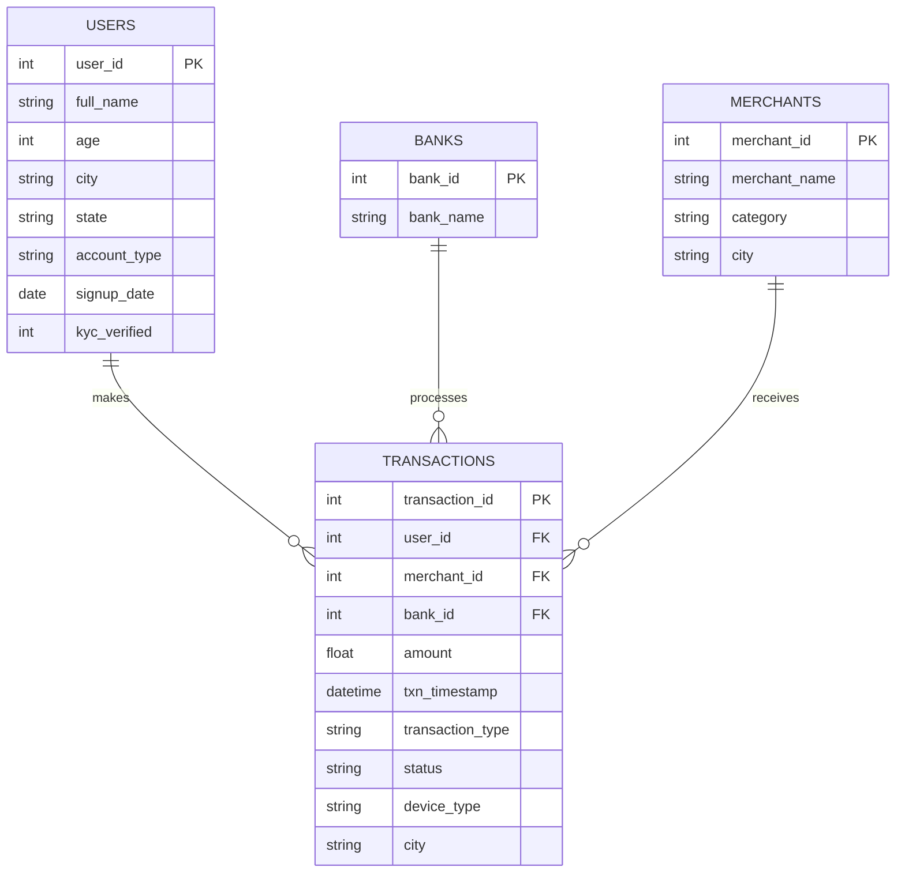

# UPI Transactions & Fraud Pattern Analytics (SQL)

A SQL project analyzing synthetic UPI (Unified Payments Interface) transaction
data, modeled after the kind of data behind apps like PhonePe, Google Pay,
and Paytm.

It covers two things:
1. **Business analytics** - revenue, growth, and bank reliability reporting
2. **Fraud detection** - flagging suspicious transaction patterns using pure SQL

> Built by Mahendar Reddy Maram | [LinkedIn](https://linkedin.com/in/mahendar-reddy-maram)

---

## Why I built this

UPI is something almost everyone in India uses daily, and fraud/risk
analytics is a skill a lot of data teams are actively hiring for. I wanted
a project where the SQL had to do real work, not just aggregate one table.
Detecting patterns spread across time, users, and merchants pushed me to
actually combine CTEs, window functions, and self-joins instead of writing
them in isolation like typical practice problems.

## Dataset

Fully synthetic, generated with `generate_data.py`. No real user data
anywhere in this project.

| Table | Rows | Description |
|---|---|---|
| `users` | 2,000 | Customer profiles across 15 Indian cities |
| `banks` | 10 | Major Indian banks |
| `merchants` | 200 | Merchants across 12 categories (Swiggy, BigBasket, IRCTC, etc.) |
| `transactions` | ~14,300 | P2P, P2M, bill payment & recharge transactions, Jan 2025 - Jun 2026 |

### Entity Relationship Diagram



### Fraud patterns built into the data

So the fraud queries would have something real to catch, I planted four
patterns into the data generator:

| Pattern | Description |
|---|---|
| **Velocity fraud** | A user firing 5+ transactions within a 2-minute window (bot-like behaviour) |
| **Odd-hour high-value** | Large transactions between 1 AM-4 AM, far above the user's typical spend |
| **Failed-retry burst** | The same small amount retried 3+ times to the same merchant before succeeding (card/UPI testing pattern) |
| **Geo-mismatch** | The same user transacting in two distant cities within a few hours ("impossible travel") |

## Files

| File | Purpose |
|---|---|
| `schema.sql` | Table definitions, constraints, indexes |
| `generate_data.py` | Generates the synthetic dataset and builds `upi_transactions.db` |
| `analysis_queries.sql` | All 12 analysis queries (business + fraud) |
| `upi_transactions.db` | Pre-built SQLite database, open it directly, no setup needed |

## How to run

**Option 1: just explore the pre-built database.**
Open `upi_transactions.db` in [DB Browser for SQLite](https://sqlitebrowser.org/)
(free) and run any query from `analysis_queries.sql` directly.

**Option 2: regenerate from scratch.**
```bash
python3 generate_data.py          # builds upi_transactions.db
sqlite3 upi_transactions.db < analysis_queries.sql
```

Queries are plain SQL. Moving them to MySQL/PostgreSQL only needs small
syntax tweaks, noted in `schema.sql`.

## SQL techniques in here

- CTEs, including a few queries that chain 3-4 of them together
- Window functions: `ROW_NUMBER()`, `RANK()`, `NTILE()`, `LAG()`, running `SUM() OVER`
- Self-joins to catch duplicate transactions and geo-mismatch patterns
- Conditional aggregation (`CASE WHEN` inside `SUM`/`COUNT`)
- RFM-style customer segmentation
- A composite fraud score built by combining 4 CTEs with `UNION ALL`
- Basic indexing for query performance on ~14K rows

## Sample results

**Top merchants by revenue:**

| Merchant | Category | Revenue (₹) |
|---|---|---|
| RedBus | Travel | 3,27,689.67 |
| ICICI Prudential | Insurance | 3,00,201.04 |
| LIC Premium | Insurance | 2,81,252.37 |

**Fraud detection:** the composite scoring query (`B5` in `analysis_queries.sql`)
flagged **22 users** matching the patterns I'd planted in the data. No manual
labeling involved, just SQL logic combining velocity, timing, retry, and
location signals into one score.

## What I'd add next

- Move this into a real MySQL/PostgreSQL instance with a stored procedure for daily fraud scoring
- Build a Power BI/Tableau dashboard on this same dataset (see my Power BI project in this portfolio)
- Add a scikit-learn model to compare rule-based vs. ML-based fraud detection

---
Note: all data here is synthetic, generated specifically for this project. No real transactions or personal information involved.
