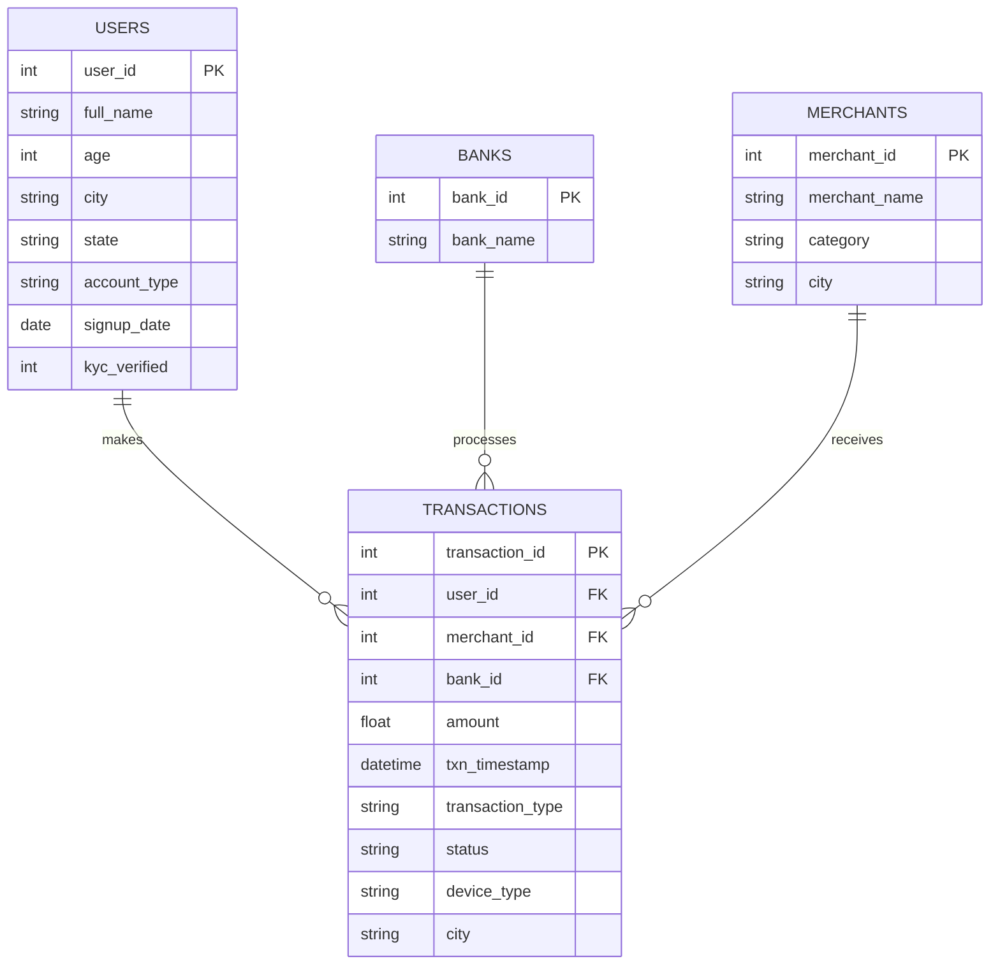

# UPI Transactions & Fraud Pattern Analytics (SQL)

A SQL-only analytics project built on a synthetic dataset modeled after
India's UPI (Unified Payments Interface) digital payments ecosystem —
the same kind of transaction data used by PhonePe, Google Pay, and Paytm.

The project has two goals:
1. **Business analytics** — revenue, growth, and reliability reporting.
2. **Fraud detection** — flag suspicious transaction patterns using pure SQL,
   the same conceptual approach used by real fintech risk engines.

> Built by Mahendar Reddy Maram | [LinkedIn](https://linkedin.com/in/mahendar-reddy-maram)

---

## Why this project

UPI processes billions of transactions a month in India, and fraud/risk
analytics is one of the highest-demand skill areas in Indian data teams
right now. This project demonstrates that I can go beyond basic `SELECT`
statements and write the kind of layered, CTE-heavy, window-function SQL
that production analytics and risk teams actually use.

## Dataset

Synthetically generated (`generate_data.py`) — no real user data involved.

| Table | Rows | Description |
|---|---|---|
| `users` | 2,000 | Customer profiles across 15 Indian cities |
| `banks` | 10 | Major Indian banks |
| `merchants` | 200 | Merchants across 12 categories (Swiggy, BigBasket, IRCTC, etc.) |
| `transactions` | ~14,300 | P2P, P2M, bill payment & recharge transactions, Jan 2025 – Jun 2026 |

### Entity Relationship Diagram



### Injected fraud patterns

To give the fraud queries real signal to detect, four patterns were
deliberately embedded in the synthetic data:

| Pattern | Description |
|---|---|
| **Velocity fraud** | A user firing 5+ transactions within a 2-minute window (bot-like behaviour) |
| **Odd-hour high-value** | Large transactions between 1 AM–4 AM, far above the user's typical spend |
| **Failed-retry burst** | The same small amount retried 3+ times to the same merchant before succeeding (card/UPI testing pattern) |
| **Geo-mismatch** | The same user transacting in two distant cities within a few hours ("impossible travel") |

## Files

| File | Purpose |
|---|---|
| `schema.sql` | Table definitions, constraints, indexes |
| `generate_data.py` | Generates the synthetic dataset and builds `upi_transactions.db` |
| `analysis_queries.sql` | All 12 analysis queries (business + fraud) |
| `upi_transactions.db` | Pre-built SQLite database — open directly, no setup needed |

## How to run

**Option 1 — just explore the pre-built database**
Open `upi_transactions.db` in [DB Browser for SQLite](https://sqlitebrowser.org/)
(free) and run any query from `analysis_queries.sql` directly.

**Option 2 — regenerate from scratch**
```bash
python3 generate_data.py          # builds upi_transactions.db
sqlite3 upi_transactions.db < analysis_queries.sql
```

All queries are written in standard SQL and are portable to MySQL/PostgreSQL
with minor syntax adjustments (noted in `schema.sql`).

## SQL techniques demonstrated

- Common Table Expressions (CTEs), including chained/multiple CTEs
- Window functions: `ROW_NUMBER()`, `RANK()`, `NTILE()`, `LAG()`, running `SUM() OVER`
- Self-joins for pattern detection (duplicate & geo-mismatch checks)
- Conditional aggregation (`CASE WHEN` inside `SUM`/`COUNT`)
- RFM-style customer segmentation
- Multi-signal fraud scoring by combining several CTEs with `UNION ALL`
- Indexing strategy for query performance on a 14K+ row transaction table

## Key results (sample)

**Top merchants by revenue:**

| Merchant | Category | Revenue (₹) |
|---|---|---|
| RedBus | Travel | 3,27,689.67 |
| ICICI Prudential | Insurance | 3,00,201.04 |
| LIC Premium | Insurance | 2,81,252.37 |

**Fraud detection hit rate:** the composite risk-scoring query
(`B5` in `analysis_queries.sql`) successfully flagged **22 users**
carrying the injected fraud patterns — with zero manual labeling,
purely from SQL logic layered across velocity, timing, retry, and
geography signals.

## What I'd add next

- Move this into a real MySQL/PostgreSQL instance with a stored procedure
  for daily fraud scoring
- Build a Power BI/Tableau dashboard on top of this same dataset
  (see my Power BI project in this portfolio)
- Add a Python scikit-learn model to compare rule-based vs. ML-based
  fraud detection accuracy

---
*This is a learning/portfolio project using entirely synthetic data.
No real financial or personal data is used anywhere in this project.*
